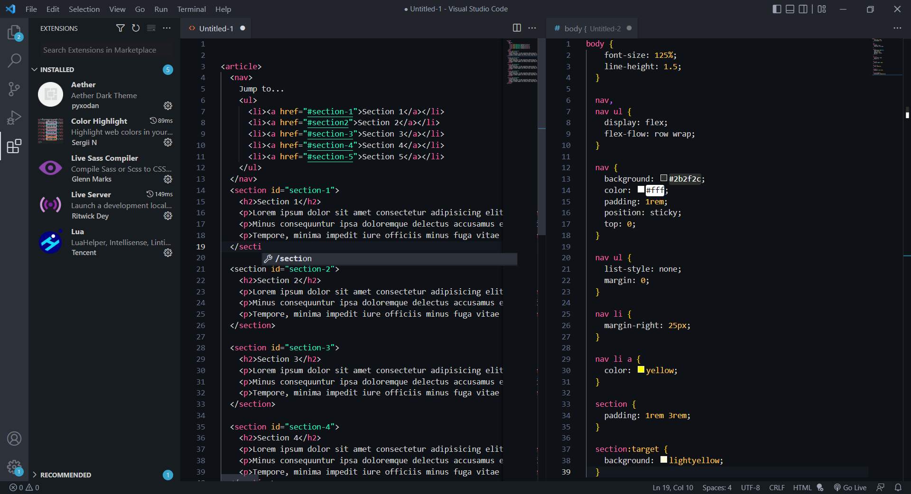

# Aether Theme for Visual Studio Code
This repo contains my custom vscode theme using a slightly modified version of the [https://github.com/ilham25/dotfiles-openbox](aether color scheme).

## Installation
Copy the 'pyxodan.aether-xxx' (xxx stands for the current version) folder into your vscode extension directory.
Restart vscode if an instance is running and the theme should be visible under your installed extensions.
